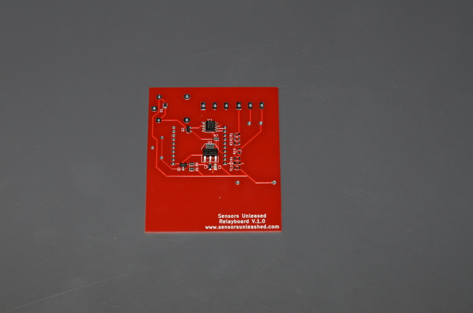
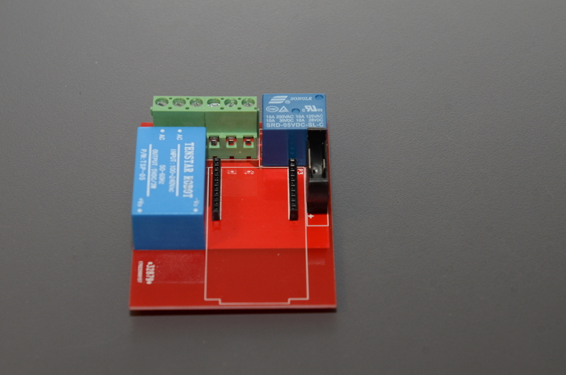
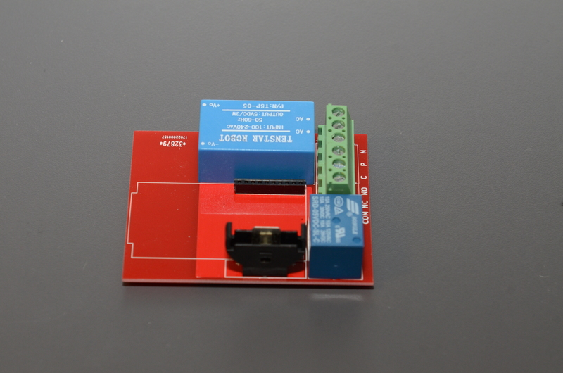
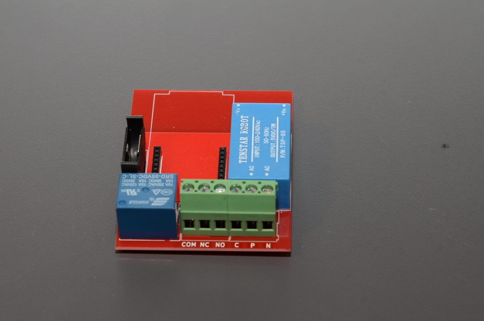
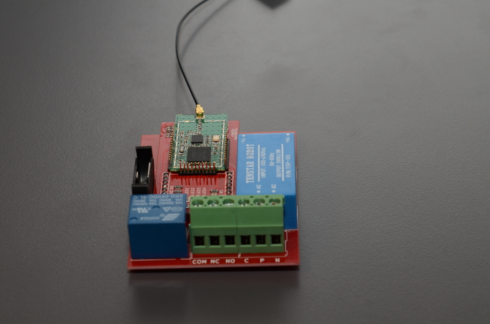
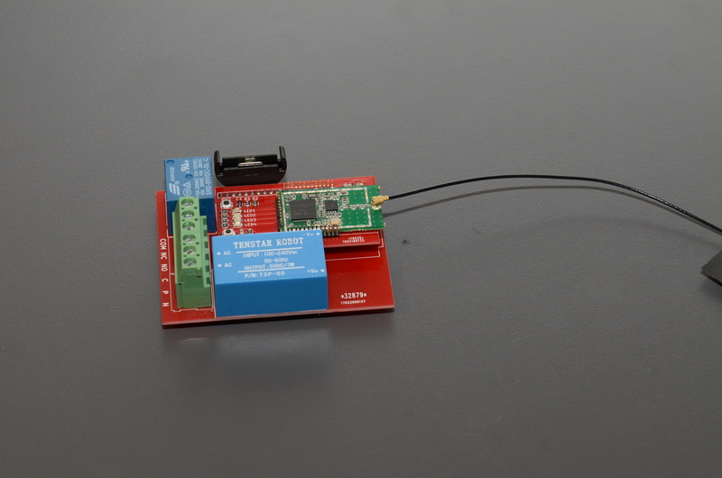
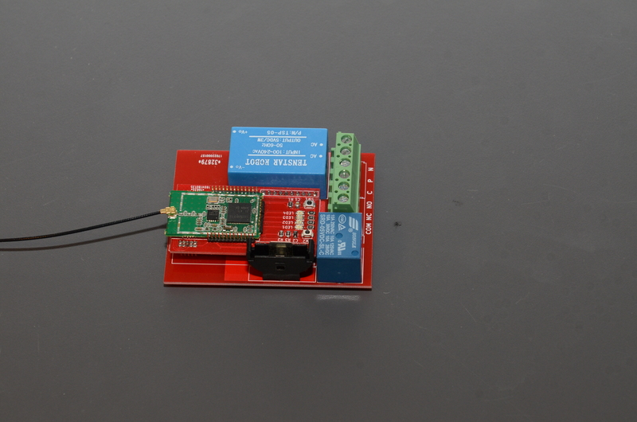

# relayboard

Simple board that is powered by both mains and a button cell battery.

It is able to:
* Operate a Single Pole Double Throw relay
* Has an i2c eeprom
* Can attach to a Sensors Unleashed radio module
* If mains is lost, the relay will release, but the radio will still be operating. This means that messages can still be send even though power is removed.

This board has many uses, but some ideas could be:
Use any installation in the house as input for the system. This device will detect if mains is on or off, and send messages as instructed. Perhaps turning on/off lamps or plugs in another location in a house.

The relay can be used to switch anything - lights, pumps, home appliances and so on.

Below you can see the prototype board.

